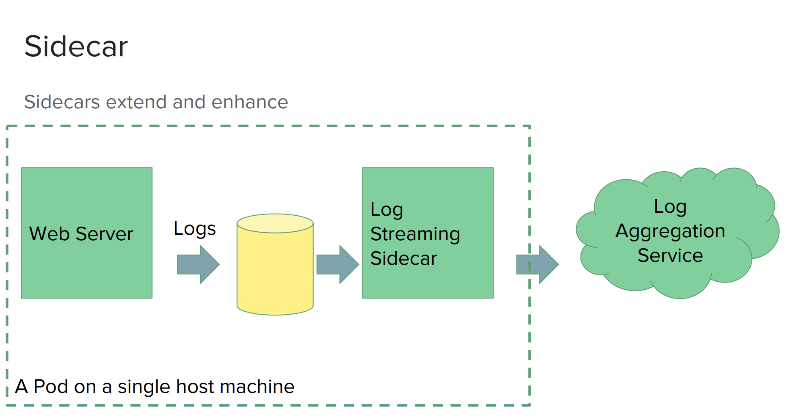
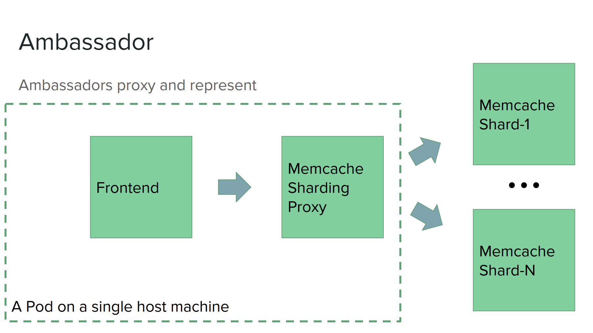

# 5. 파드
파드는 컨테이너를 묶어서 관리하는 단위  
- 컨테이너들이 같은 목적으로 자원을 공유하는 것이 목표라고 함.
```mermaid
flowchart LR
    pod --> container1
    pod --> container2
    pod --> container3
```

## 파드 사용법
파드 설정 예(책에서 가져온 것)
```yaml
apiVersion: v1
kind: Pod
metadata: 
    name: kubernetes-simple-pod # 파드 이름
    labels:
        app: kubernetes-simple-pod # 오브젝트를 식별하는 레이블
spec:
    containers:
    - name: kubernetes-simple-pod # 컨테이너의 이름
      image: arisu1000/simple-container-app:lastest # 컨테이너 이미지
      ports:
      -  containerPort: 8080 # 컨테이너에 접속할 포트
    - name: kubernetes-simple-pod2 # 컨테이너의 이름 두번째 (여러개 하고 싶으면)
      image: arisu1000/simple-container-app:lastest # 컨테이너 이미지
      ports:
      -  containerPort: 8080 # 컨테이너에 접속할 포트
```

생성하면 다음과 같다. (푸하하 이거 왜이래 이미지 못가져오네)
```bash
kube kubectl get pods
NAME                                     READY   STATUS         RESTARTS         AGE
kubernetes-simple-pod                    0/2     ErrImagePull   0                33s
```

## 파드 생명주기
- pending: 생성중 (이미지 다운로드 -> 컨테이너 실행)
- running: 실행중
- succedded: 모든 컨테이너 종료
- failed: 정상적으로 실행 종료된 컨테이너가 있다.
- unknown: 알수없음 (통신 두절 등의 이유)

## kubelet 선생님의 컨테이너 진단
아래 두가지 프로브 라는게 있다고 함(이게 뭔데)
- livenesProve: 컨테이너 실행 확인
- readinessProve: 컨테이너 서비스 요청 응답확인 

    -> 뭐가 좋다는건지 이해 못함.. 도와줘요..  
    -> 이게 컨테이너가 요청에 응답할 수 있는지 확인하니까 초기설정중에 요청 날리는 상황을 방지하는건가?


컨테이너 진단은 컨테이너가 구현한 핸들러를 kubelet 호출해서 판단하는 방식임  
핸들러는 아래와 같다.
- ExecAction: 컨테이너 안에 명령을 실행하고 종료 코드가 0일때 Success
- TCPSocketAction: 컨테이너의 IP와 포트로 TCP 상태를 확인하고 포트가 열려있으면 Success
- HTTPGetAction: 컨테이너 안에 지정된 IP, 포트, url로 get 날리고 응답상태보고 Success

## 초기화 컨테이너 init container
이건 앱 컨테이너 app container가 실행되기 전에 파드를 초기화 한다.  
- 보안상 이슈가 발생할 수 있을때 사용한다고 함.
- 초기화 컨테이너가 모두 실행 성공해야 앱 컨테이너가 실행됨 (초기화 컨테이너는 실패하면 성공할때까지 재시작함)
- readinessProbe지원 안함

아래 처럼 initContainers아래에 정의하면 된다.  
```yaml
apiVersion: v1
kind: Pod
metadata: 
    name: kubernetes-simple-pod # 파드 이름
    labels:
        app: kubernetes-simple-pod # 오브젝트를 식별하는 레이블
spec:
    initContainters:
      - name: init-myservice
        image: arisu1000/simple-container-app:latest
        command: ['sh', '-c', 'sleep 2; echo helloworld01;']
      - name: init-mydb
        image: arisu1000/simple-container-app:latest
        command: ['sh', '-c', 'sleep 2; echo helloworld02;']
      containers:
      ...
```

## 파드 인프라 컨테이너
pause라는 컨테이너로, 모든 파드에서 항상 실행됨. 이 친구를 파드 인프라 컨테이너라고 함  
- 다른 컨테이너들의 부모 컨테이너 역할을 함
- 다른 컨테이너들이 요놈의 네트워크를 공유해서 사용함

## 스태틱 파드 static pod
kube-apiserver를 통하지 않고 kubelet이 직접 실행하는 파드  
`--pod-manifest-path`라는 옵션에 지정한 디렉터리에 스태틱 파드를 넣어두면 kubelet이 파드로 실행함.

*여기서 잠깐!*

파드를 실행할때는 `kubectl`를 사용했잖아?! `kube-apiserver`는 뭐야?  
`kube-apiserver`는 REST api서버로 되어있는데, 요놈을 통해서 파드를 생성할 수 있다는 것 같음.  

주소는? 아래와 같이 명령어를 입력하면 찾을 수 있다.
```bash
> kubectl cluster-info
Kubernetes control plane is running at https://127.0.0.1:6443
```

ref: https://coffeewhale.com/apiserver

책에 나온 것 처럼 kube-apiserver.yaml을 수정하면  
kubelet이 이걸 감지하고 kube-apiserver 파드를 다시 실행해준다. (책에서는 다른 스태틱 파드를 쓰는데, 그 파드는 aws 서버에선 없드라구요)
```bash
root@node1:/etc/kubernetes/manifests# nano kube-apiserver.yaml
root@node1:/etc/kubernetes/manifests# kubectl describe pods kube-apiserver -n kube-system | grep TEST
      TEST:  test
```

## 파드에 CPU와 메모리 자원 할당

쿠버네티스가 파드를 스케줄링할 때는 `.spec.containers[].resources.requests`와  
`.spec.containers[].resources.limits`만을 확인한다.

설정 된것만 보기 때문에 제대로 안해놓으면 out of memory가 발생할 수 있다.

cpu는 코어수를 의미한다. (이 코어는 실제 코어일까? 아니면 코어 스레드할때 스레드일까?)

```yaml
...
spec:
    containers:
    - name: kubernetes-simple-pod 
      image: arisu1000/simple-container-app:lastest
      resources:
        requests: # 최소 자원 요구량
          cpu: 0.1 
          memory: 200M
        limits: # 최대 자원 활용량
          cpu: 0.5
          memory: 1G
    ...
```

## 파드에 환경변수 설정

```yaml
...
spec:
    containers:
    - name: kubernetes-simple-pod 
      image: arisu1000/simple-container-app:lastest
      env:
      - name: TESTENV01 # env 이름
        value: "testvalue01" # env 값
      - name: HOSTNAME
        valueForm: # 값을 참조해서 가져오겠다.
          fieldRef:
            fieldPath: sepc.nodeName # 여기서 가져올게염
    ...
```

## 파드 환경 설정 내용 적용

## 파드 구성 패턴
파드로 컨테이너를 묶어 구성할때 쓰이는 디자인 패턴이 있는듯.  
ref: https://www.usenix.org/sites/default/files/conference/protected-files/hotcloud16_slides_burns.pdf


### 사이드카 패턴
기본 컨테이더를 확장하거나 강화하는 용도의 컨테이너 추가.  
재사용성이 좋음  


### 앰배서더 패턴
파드 안에서 프록시 역할을 하는 컨테이너 사용  


### 어댑터 패턴
외부로 노출되는 정보를 표준화하는 어댑터 컨테이너?(잘 모르겠다)  
