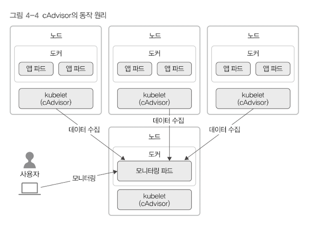
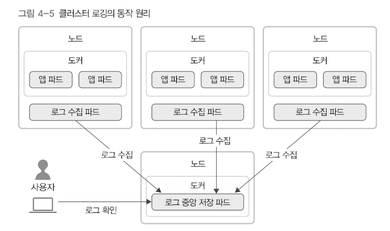

# 4. 쿠버네티스 아키텍처 
## 1) 쿠버네티스 클러스터의 전체 구조

- 쿠버네티스 클러스터의 구성
  - 마스터 : 클러스터를 관리
  - 노드 : 실제 컨테이너를 실행 

### 마스터 
- 실행되는 컴포넌트 리스트
  - etcd
  - kube-apiserver
  - kube-scheduler
  - kube-controller-manager
  - kubelet
  - kube-proxy
  - docker
  - etc

- 고가용성
  - 서버 3대 정도를 구성해서 운영하는 것이 일반적
  - 리더 마스터 1대 + 나머지 2대는 대기 
  - 리더 마스터 장애 -> 나머지 2대 중 1대가 리더 
  - 5대로 구성하기도

### 노드 
- 실행되는 컴포넌트 리스트
  - kubelet
  - kube-proxy
  - docker
  - etc

### 통신 구조 

- kube-apiserver
  - 쿠버네티스의 모든 통신의 중심 
  - 해당 서버를 거쳐서 다른 컴포넌트가 서로 필요한 정보를 주고 받음 
  - etcd에는 kube-apiserver만 접근 가능
- kubelet
  - 마스터에 있는 도커를 관리 
  - 관리용 컴포넌트들을 컨테이너로 실행 
  - 관리용 컴포넌트 모두는 하이퍼큐브라는 바이너리 파일로 컴파일되었고, 실행할 때 옵션을 설정해 각 컴포넌트의 역할을 수행함
- etcd 
  - 컨테이너가 아닌 별도의 프로세스로 설정
- 노드의 kubelet
  - 마스터의 kube-apiserver와 통신하면서 pod의 생성, 관리, 삭제를 담당함 
  - 노드의 kube-proxy는 마스터와는 다르게 컨테이너가 아니라 서버 프로세스로 실행 가능 (컨테이너도 가능)

---

## 2) 쿠버네티스의 주요 컴포넌트 
> 쿠버네티스는 근본적으로 클러스터를 관리 
> - 클러스터는 단일 컴퓨터가 아닌, 여러대의 컴퓨터를 하나의 묶음으로 다루는 것을 뜻함
>   - 여러 가지 컴포넌트를 포함함 
> - 쿠버네티스의 컴포넌트는 세 가지로 구분 
>   - 마스터용 컴포넌트, 노드용 컴포넌트, 애드온용 컴포넌트

### 마스터용 컴포넌트
- 실제 클러스터 전체를 관리
- etcd, kube-apiserver, kube-scheduler, kube-controller-manager, cloud-controller-manager

#### etcd
- 고가용성을 제공하는 key-value store
  - 필요한 모든 데이터를 저장하는 DB 역할
  - 코어 OS에서 개발 
  - 분산 시스템에서 노드 사이의 상태를 공유하는 consensus 알고리즘 중 하나인 [raft 알고리즘](https://seongjin.me/raft-consensus-algorithm/)을 구현한 것
    - 모든 노드가 동일한 상태를 유지하도록 하고, 일부 노드에 결함이 생기더라도 전체 시스템이 문제 없이 동작하도록 만들기 위해 고안됨 
    - etcd 클러스터 뿐만 아니라, MongoDB의 replica set 등 다양한 영역에 활용되는 알고리즘 
    - 클러스터 전체에 대한 명령이 오직 리더로부터 팔로워에게 일방향으로 전파되도록 동작

- 서버 하나 당 프로세스 1개만 사용 가능 
  - 보통 etcd 자체를 클러스터링 → 여러 개 마스터 서버에 분산해서 실행 → 데이터 안정성 보장

#### kube-apiserver
- 쿠버네티스 클러스터의 API를 사용할 수 있도록 하는 컴포넌트 
- 클러스터에 들어온 요청이 유효한지를 검증 
- 쿠버네티스에 보내는 모든 요청은 해당 컴포넌트를 통해 다른 컴포넌트로 전달 됨 
- 수평적 확장 가능 

#### kube-scheduler
- 현재 클러스터 안에서 자원 할당이 가능한 노드 중 알맞은 노드를 선택해서 새롭게 만든 파드를 실행함 
- 파드는 처음 실행 시 여러가지 조건을 설정 → kube-scheduler는 조건에 맞는 노드를 찾음 
- 조건 : 하드웨어 요구사항, 함께 있어야 하는 파드들을 같은 노드에 실행하는 어피니티, 파드를 다양한 노드로 분산해서 실행하는 안티 어피니티 만족 여부, 특정 데이터가 있는 노드에 할당...

#### kube-controller-manager
- 파드들을 관리하는 컨트롤러 
  - 컨트롤러 각각은 논리적으로 개별 프로세스
  - 복잡도를 줄이기 위해 모든 컨트롤러를 하나의 바이너리 파일로 컴파일 → 단일 프로세스로 실행
- kube-controller-manager는 컨트롤러 각각을 실행하는 컴포넌트 
  - 클러스터 안에서 새로운 컨트롤러를 사용 → 컨트롤러에 해당하는 구조체 생성 → kube-controller-manager가 관리하는 큐에 넣어서 실행 

#### cloud-controller-manager
- 쿠버네티스의 컨트롤러들을 클라우드 서비스와 연결해 관리하는 컴포넌트
- 관련 컴포넌트의 소스 코드는 각 클라우드 서비스에서 직접 관리 
- 보통 네 가지 컨트롤러 컴포넌트를 관리
  - 노드 컨트롤러 : 클라우드 서비스 안에서 노드를 관리하는 데 사용
  - 라우트 컨트롤러 : 각 클라우드 서비스 안의 네트워크 라우팅을 관리하는 데 사용
  - 서비스 컨트롤러 : 각 클라우드 서비스에서 제공하는 로드밸런서를 생성, 갱신, 삭제하는 데 사용 
  - 볼륨 컨트롤러 : 클라우드 서비스에서 생성한 볼륨을 노드에 연결하거나 마운트하는 등에 사용 

### 노드용 컴포넌트
- 쿠버네티스 실행 환경을 관리 
  - 대표적으로 각 노드의 파드 실행을 관리
- kubelet, kube-proxy, container runtime 등

#### kubelet
- 클러스터 안 모든 노드에서 실행되는 에이전트 
- 파드 컨테이너들의 실행을 직접 관리 
- kubelet은 podspec이라는 조건이 담긴 설정을 전달 받아 컨테이너를 실행 & 헬스 체크 진행 
  - 노드 안에 있는 컨테이너라도, 쿠버네티스가 만들지 않은 컨테이너는 관리하지 않음

#### kube-proxy
- 쿠버네티스는 클러스터 내에 별도의 가상 네트워크를 설정하고 관리함 
- 가상 네트워크의 동작을 관리하는 컴포넌트
- 호스트의 네트워크 규칙을 관리하거나 연결을 전달할 수도 있음 

#### 컨테이너 런타임 
- 실제로 컨테이너를 실행시킴 
- 가장 많이 알려진 런타임 → "도커"
  - containerd, runc...
  - Open Container Initiative의 runtime-spec을 구현한 컨테이너 런타임이라면 쿠버네티스에서 사용 가능

### 애드온
- 클러스터 안에서 필요한 기능을 실행 
- 네임스페이스는 `kube-system`
- 애드온으로 사용하는 파드들은 디플로이먼트, 리플리케이션 컨트롤러 등으로 관리 

#### 네트워킹 애드온
- 클러스터 안에 가상 네트워크를 구성 → `kube-proxy`이외에 네트워킹 애드온(네트워크 플러그인)을 사용 
- aws, azure, google cloud 등 클라우드 서비스에서 제공하는 쿠버네티스를 사용한다면 별도의 네트워킹 애드온을 제공함 
- 쿠버네티스를 직접 서버에 구성한다면 네트워킹 관련 애드온을 설치해서 사용해야 함 

#### DNS 애드온 
- 클러스터 안에서 동작하는 DNS 서버 
- 쿠버네티스 서비스에 DNS 레코드 제공 
- 쿠버네티스 내부에 실행된 컨테이너들은 자동으로 DNS 서버에 등록 됨
- 주로 사용하는 DNS 애드온
  - `kube-dns`, `CoreDNS`
  - 최근에는 `CoreDNS`가 기본 DNS 애드온임 

#### 대시보드 애드온
- `kubectl`이라는 CLI를 많이 사용하지만, 웹 UI로 쿠버네티스를 사용할 필요도 있을 것임
- 쿠버네티스는 이를 위해 대시보드 애드온을 제공 

#### 컨테이너 자원 모니터링

- 클러스터 안에서 실행 중인 컨테이너의 상태를 모니터링 
- CPU 및 메모리 사용량 같은 데이터들을 시계열 형식으로 저장해서 볼 수 있음
- 위 그림에서는 kubelet 안에 포함된 cAdvisor라는 컨테이너 모니터링 도구가 나타나 있음.
- cAdvisor에서는 자원 사용량 데이터를 수집하는 메트릭 서버를 손쉽게 모니터링에 이용

#### 클러스터 로깅

- 클러스터 안 개별 컨테이너의 로그와 쿠버네티스 구성 요소의 로그들을 중앙화한 로그 수집 시스템에 모아서 보는 애드온 
- 각 노드에 로그를 수집하는 파드 실행 → 로그 중앙 저장 파드로 로그를 수집 
- 로그를 수집해서 보여줄 때는 ELK(ElasticSearch, Logstash, Kibana)나 EFK(ElasticSearch, Fluentd, Kibana)를 많이 사용함

---

## 3) 오브젝트와 컨트롤러
